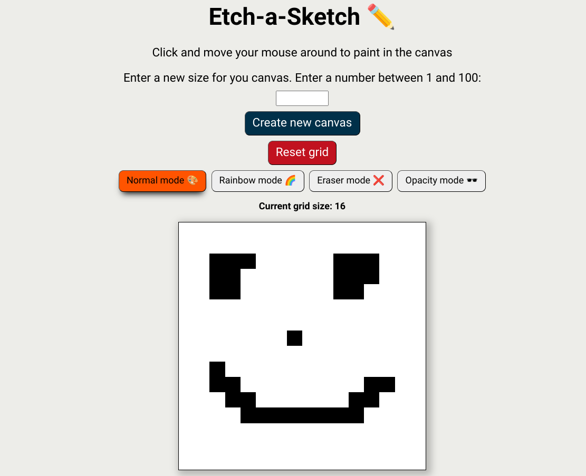

# ✏️ Etch-a-Sketch

## Overview
A simple Etch-a-Sketch webpage that allows you to draw or paint on a canvas 

Live demo: https://julioapv.github.io/etch-a-sketch/

## 🚀 **Project Highlights**
- Interactive grid-based sketchpad application.
- Supports multiple drawing modes: normal, rainbow, opacity (gradual darkening), and eraser.
- Users can dynamically resize the grid (from 1x1 to 100x100).
- Intuitive UI for seamless drawing.
- Built with modular code.

## ✨ **Key Features**
1. **Drawing Modes:**
   - **Normal:** Draw in black on the grid.
   - **Rainbow:** Generate random colors for each hover.
   - **Opacity:** Gradually darkens each square with every hover.
   - **Eraser:** Removes color by resetting a square to white.
2. **Dynamic Grid Resizing:**
   - Adjust grid size in real-time using the input field (up to 100x100 squares).
3. **Reset Functionality:**
   - Clear the grid and reset it to the default state.
4. **User-Friendly Controls:**
   - Buttons to switch between modes and manage the grid easily.

## 🎯 **Learning Objectives**
- Understand DOM manipulation and event handling in JavaScript.
- Work with `data-*` attributes for per-element state management.
- Implement dynamic styles and responsiveness using CSS and JavaScript.
- Enhance debugging and modularization of code for future scalability.

## 🕹️ **How to Use It**
1. Open the website in your browser.
2. Draw on the grid by clicking and dragging your cursor across squares.
3. Switch between drawing modes using the corresponding buttons:
   - **Normal:** Draw in black.
   - **Rainbow:** Draw with random colors.
   - **Opacity:** Gradually darken squares.
   - **Eraser:** Erase by turning squares white.
4. Resize the grid by entering a size (1-100) in the input field and clicking the "Change Grid Size" button.
5. Use the "Reset Grid" button to clear all drawings and start fresh.

## 🛠️ **Technologies Used**
- **HTML5:** For structuring the application.
- **CSS3:** For styling and layout.
- **JavaScript (ES6):** For interactivity and functionality.

---

Happy Drawing! :)

